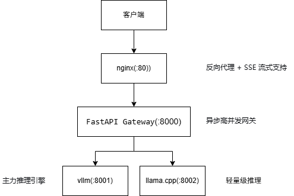

# LLM Inference Gateway V2

多引擎推理网关，兼容OpenAI API，支持智能路由和流式输出，一键Docker部署。

## 架构

```
Client → Nginx(:80) → FastAPI Gateway(:8000)
                            ├─ vLLM(:8001)     ← 长文本 (>512 tokens)
                            └─ llama.cpp(:8002) ← 短文本 (≤512 tokens)
```

路由策略：估算input tokens，>512走vLLM，≤512走llama.cpp。支持手动切换(auto/vllm/llama)。



## 特性

- ✅ **OpenAI兼容**：标准 `/v1/chat/completions` 接口，支持stream=true/false
- ✅ **input_tokens智能路由**：自动估算token数路由，或手动切换auto/vllm/llama
- ✅ **请求级计时**：TTFT/TPOT/gateway_overhead，每个请求记录structured JSON日志
- ✅ **错误码规范**：502 backend_unavailable / 504 backend_timeout / 500 internal_error，均带trace_id
- ✅ **客户端断连取消**：流式模式下客户端断开自动取消后端请求
- ✅ **流式输出**：支持SSE (Server-Sent Events)打字机效果
- ✅ **Docker一键部署**：docker-compose up

## 接口

| 方法 | 路径 | 说明 |
|------|------|------|
| POST | `/v1/chat/completions` | OpenAI兼容推理接口，支持stream=true/false |
| GET  | `/health` | 健康检查 |
| GET  | `/admin/backends` | 后端存活状态（vllm/llama是否可达） |
| POST | `/admin/switch-backend` | 手动切换模式 `{"mode":"auto"|"vllm"|"llama"}` |

## 环境变量

| 变量 | 默认值 | 说明 |
|------|--------|------|
| `VLLM_BACKEND_URL` | `http://host.docker.internal:8001/v1/chat/completions` | vLLM后端地址 |
| `LLAMA_BACKEND_URL` | `http://host.docker.internal:8002/v1/chat/completions` | llama.cpp后端地址 |
| `TOKEN_THRESHOLD` | `512` | 路由token数阈值（AUTO模式下） |
| `BACKEND_MODE` | `auto` | 路由模式：auto/vllm/llama |
| `REQUEST_TIMEOUT` | `60` | 请求超时秒数 |

## 网关开销

本地测试（RTX 5060, Qwen2.5-7B-Instruct Q4_K_M, 128in/128out）：

| 并发 | Direct E2E | Gateway E2E | 开销 | 占比 |
|------|-----------|-------------|------|------|
| 1 | 1627ms | 1662ms | +34ms | 2.1% |
| 4 | 4047ms | 4053ms | +6ms | 0.15% |
| 8 | 7676ms | 7595ms | -81ms | -1.1% |
| 16 | 12826ms | 12842ms | +17ms | 0.13% |
| 30 | 16728ms | 16779ms | +52ms | 0.31% |

**结论：网关开销 <2%，几乎可忽略。**

## 快速开始

### 本地开发

```bash
# 1. 启动llama.cpp后端
cd ~/projects/llama.cpp && ./build_cuda/bin/llama-server \
  -m models/qwen2.5-7b-instruct-Q4_K_M.gguf \
  --host 0.0.0.0 --port 8002 -ngl 99

# 2. 启动vLLM后端（需16GB+显存，或在AutoDL上）
# python -m vllm.entrypoints.openai.api_server \
#   --model Qwen2.5-7B-Instruct-GPTQ-Int4 --port 8001

# 3. 配置环境变量
cp .env.example .env
# 编辑 .env 设置后端URL

# 4. 启动网关
cd ~/projects/llm-inference-platform && source venv/bin/activate
PYTHONPATH=src uvicorn gateway.gateway:app --host 0.0.0.0 --port 8000 --reload
```

### Docker部署

```bash
docker-compose up -d
```

### 验证

```bash
# 健康检查
curl http://localhost:8000/health

# 后端状态
curl http://localhost:8000/admin/backends

# 手动切换后端
curl -X POST http://localhost:8000/admin/switch-backend \
  -H "Content-Type: application/json" \
  -d '{"mode":"llama"}'

# 非流式请求
curl -X POST http://localhost:8000/v1/chat/completions \
  -H "Content-Type: application/json" \
  -d '{"model":"qwen","messages":[{"role":"user","content":"你好"}],"max_tokens":50}'

# 流式请求
curl -N -X POST http://localhost:8000/v1/chat/completions \
  -H "Content-Type: application/json" \
  -d '{"model":"qwen","messages":[{"role":"user","content":"你好"}],"stream":true,"max_tokens":50}'
```

## 压测

```bash
# 直压llama.cpp
python src/benchmark/benchmark.py \
  --backend llama \
  --url http://localhost:8002/v1/chat/completions \
  --model qwen2.5-7b-instruct-Q4_K_M \
  --quant gguf-q4_k_m \
  --concurrency 1,4,8,16,30 \
  --num-requests 30 \
  --input-tokens 128 \
  --max-tokens 128 \
  --output docs/W4/baseline-llama-direct.csv

# 走网关（对比gateway_overhead）
python src/benchmark/benchmark.py \
  --backend gateway \
  --url http://localhost:8000/v1/chat/completions \
  --model qwen \
  --quant gguf-q4_k_m \
  --concurrency 1,4,8,16,30 \
  --num-requests 30 \
  --input-tokens 128 \
  --max-tokens 128 \
  --output docs/W4/baseline-llama-gateway.csv
```

## 项目结构

```
llm-inference-platform/
├── src/
│   ├── gateway/
│   │   ├── __init__.py
│   │   └── gateway.py          # 网关核心代码V2
│   └── benchmark/
│       ├── __init__.py
│       └── benchmark.py         # 压测脚本
├── docker/
│   ├── Dockerfile
│   └── nginx/
│       └── nginx.conf           # Nginx配置（含/admin路由）
├── docs/
│   ├── W4/                     # W4压测数据
│   └── images/
├── docker-compose.yml
├── requirements.txt
├── .env.example
└── README.md
```

## 错误码

| 错误码 | 类型 | 说明 |
|--------|------|------|
| 502 | backend_unavailable | 后端服务不可达 |
| 504 | backend_timeout | 后端响应超时(>60s) |
| 429 | rate_limited | 请求被限流（预留） |
| 500 | internal_error | 网关内部错误 |

所有错误响应包含 `trace_id` 字段，用于全链路追踪。

## 技术栈

- **FastAPI + httpx**：异步高并发网关
- **vLLM**：主力推理引擎（PagedAttention, Continuous Batching）
- **llama.cpp**：轻量级GPU推理（GGUF量化）
- **Nginx**：反向代理 + SSE流式支持
- **Docker Compose**：一键部署