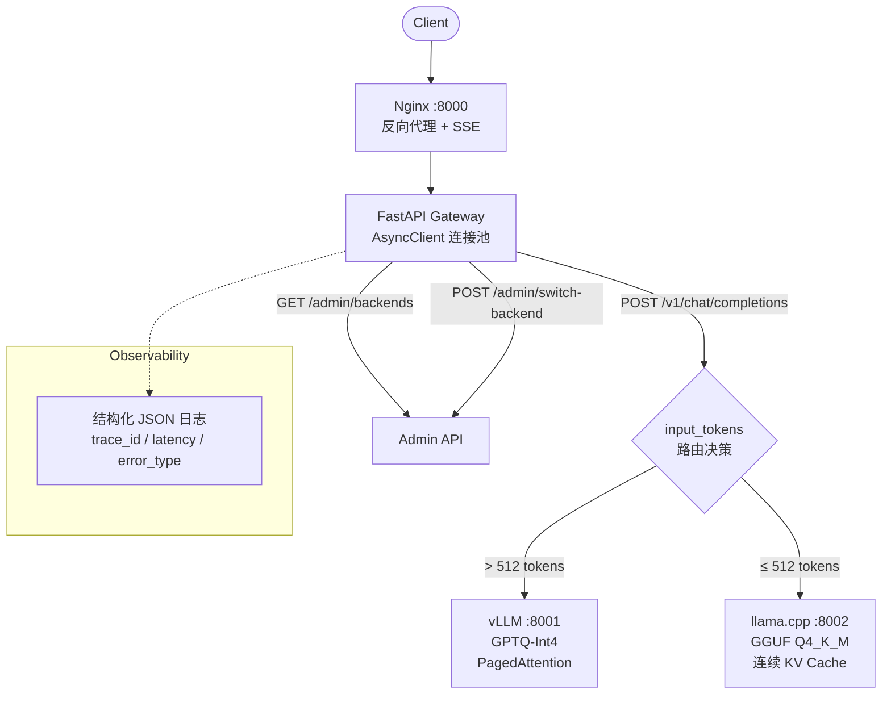
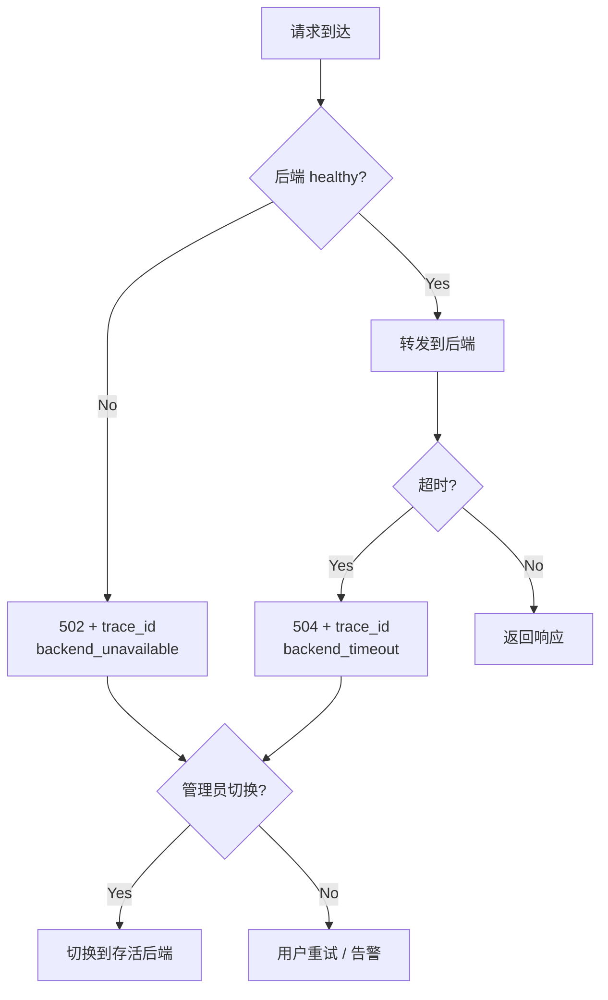

# 推理 API 网关系统设计文档

> 版本: V2 | 日期: 2026-06 | 状态: 已实现
> 仓库: [llm-inference-platform](https://github.com/ToNoName/llm-inference-platform)

---

## 1. 设计目标

- **网关转发开销 < 2% 总延迟**（实测 P50 < 0.02ms，c=30 < 0.12ms）
- **OpenAI-compatible API**（`/v1/chat/completions`，上游零改造接入）
- **单后端故障不影响服务可用性**（手动切换 + health check 探测）
- **结构化日志 + trace_id**（全链路可追踪，可直接入 ELK/Loki）

---

## 2. 系统架构



**组件**：

| 组件 | 端口 | 职责 |
|------|------|------|
| Nginx | 8000 | 反向代理、SSE 流式支持、静态文件服务 |
| Gateway | 内部 | FastAPI + httpx.AsyncClient 连接池、路由决策、错误码统一 |
| vLLM | 8001 | GPTQ-Int4 量化推理、PagedAttention + Continuous Batching |
| llama.cpp | 8002 | GGUF Q4_K_M 量化推理、连续 KV Cache、低延迟短请求 |

---

## 3. 路由策略

### 3.1 Text-based Token 估算

```python
def estimate_tokens(messages):
    text = " ".join(msg.content for msg in messages)
    cn_ratio = sum(1 for c in text if "\u4e00" <= c <= "\u9fff") / max(len(text), 1)
    if cn_ratio > 0.3:
        return int(len(text) * 0.5)   # 中文: ~2 chars/token
    return int(len(text) * 0.25)      # 英文: ~4 chars/token
```

**设计决策**：不加载 tokenizer。网关应轻量，不引入模型依赖（tokenizer 需 ~500MB 内存）。估算误差 ±20%，对路由决策（>512 vs ≤512）足够。

### 3.2 决策逻辑

```
if BACKEND_MODE == "auto":
    if estimate_tokens > 512 → vLLM（PagedAttention 管理长上下文 KV cache）
    else                    → llama.cpp（GGUF 短请求低延迟）
```

**阈值 512**：本地 RTX 5060 8GB 显存下，llama.cpp Q4_K_M 稳定运行的最大 context。长请求的 KV cache 需要 vLLM 的 block pool 防止 OOM。

### 3.3 手动模式

```
POST /admin/switch-backend {"mode": "vllm"}
                                 └─ auto | vllm | llama
```

使用场景：后端故障、灰度发布、A/B 测试、压测时强制走某个后端。

### 3.4 模型名映射

网关对外统一 `model="qwen"`，对内按后端路由：

| 对外 | vLLM 后端 | llama.cpp 后端 |
|------|----------|---------------|
| `qwen` | `Qwen2.5-7B-Instruct` | `qwen2.5-7b-instruct-Q4_K_M` |

调用方无需知道后端模型细节。映射表可扩展。

---

## 4. Fallback & 容错

### 4.1 故障处理流程



### 4.2 错误码规范

| 错误码 | 类型 | 触发条件 | 响应示例 |
|--------|------|---------|---------|
| **502** | `backend_unavailable` | 后端连接失败（进程崩溃/网络不通） | `{"error":"backend_unavailable","trace_id":"xxx"}` |
| **504** | `backend_timeout` | 推理超过 `REQUEST_TIMEOUT`（默认 60s） | `{"error":"backend_timeout","trace_id":"xxx"}` |
| **500** | `internal_error` | 网关自身代码异常 | `{"error":"internal_error","trace_id":"xxx"}` |

**trace_id**：每个请求生成 `uuid4[:8]`。用户报 trace_id，运维查日志秒级定位。

### 4.3 连接池管理

```python
# FastAPI lifespan: 启动时创建，关闭时销毁，全进程共享
app.state.http_client = httpx.AsyncClient(
    timeout=httpx.Timeout(REQUEST_TIMEOUT),
    limits=httpx.Limits(max_keepalive_connections=20, max_connections=50),
)
```

复用连接避免每请求 TCP/TLS 握手（省 2-5ms）。c=30 并发时连接池 50 个连接够用。

### 4.4 客户端断连处理

```python
async for chunk in resp.aiter_bytes():
    yield chunk
    if await req.is_disconnected():  # 用户关 Tab → 停止转发
        return
```

流式场景用户关闭浏览器后，网关立即停止向后端转发数据，不浪费 GPU 算力。

---

## 5. 可观测性

### 5.1 结构化 JSON 日志

```json
{"trace_id": "a1b2c3d4", "backend": "vllm", "model": "Qwen2.5-7B-Instruct",
 "input_tokens": 128, "output_tokens": 256, "stream": false,
 "ttft_ms": 1583, "tpot_ms": 6.18, "e2e_latency_ms": 1583,
 "backend_latency_ms": 1583, "gateway_overhead_ms": 0.0, "error_type": ""}
```

- 每条请求一行 JSON → 可直接入 ELK / Loki / Grafana
- `gateway_overhead_ms` = `e2e - backend_latency`，精确测量转发开销
- 字段统一，各端点日志结构一致

### 5.2 健康检查 API

```
GET /health           → {"status": "ok", "service": "inference-gateway"}
GET /admin/backends   → {"mode": "auto", "backends": {"vllm": {"healthy": true}, ...}}
```

运维 / K8s liveness probe 直接调 `/health`。`/admin/backends` 用于实时查看各后端存活状态。

---

## 6. 性能验证

### 6.1 Benchmark 方法论

| 变量 | 取值 |
|------|------|
| Input tokens | 128 / 512 / 1024 |
| Output tokens | 64 / 256 / 512 |
| Concurrency | 1 / 4 / 8 / 16 / 30 |
| 量化 | FP16 / GPTQ-Int4 / GGUF Q4_K_M |

**测量指标**：TTFT、TPOT（P50/P90/P99）、E2E Latency、tokens/s  
**数据有效性**：P99 ≥ 30 样本，P50/P90 ≥ 5 样本  
**压测脚本**：`src/benchmark/benchmark.py`（CLI 参数化）+ `matrix_bench.py`（自动编排）

### 6.2 网关开销

| 并发 | Direct TPOT_P50 | Gateway TPOT_P50 | 开销 |
|------|----------------|-----------------|------|
| 1 | 6.18ms | 6.18ms | **+0.00ms** |
| 4 | 6.45ms | 6.45ms | +0.00ms |
| 8 | 6.71ms | 6.66ms | -0.05ms (噪声) |
| 16 | 7.71ms | 7.46ms | -0.25ms (噪声) |
| 30 | 8.69ms | 8.81ms | **+0.12ms (1.4%)** |

**结论：网关开销 < 2%，在 c=1 时低于测量精度（0.00ms），在所有并发级别下可忽略。**

> 详细数据: `docs/W4/vllm-params-notes.md` | 本地基准: `docs/W5/report.md`

---

## 7. 设计决策

### 7.1 为什么用 Text-based Token 估算？

**选**: 字符串长度 × 语言系数  
**不选**: 加载 tokenizer 精确计算

Token 估算误差 ±20%，但对路由决策（是否 >512）足够。网关应轻量：不依赖模型文件、不引入 tokenizer 内存开销（~500MB）。

### 7.2 为什么双后端而不是单 vLLM？

vLLM 的 PagedAttention 在长上下文高并发有绝对优势，但短请求（<512 tokens）下 llama.cpp 的 GGUF 极低延迟更有优势。两个引擎互补，而非竞争。

### 7.3 为什么用 AsyncClient 连接池？

`AsyncClient(timeout, limits)` 在 FastAPI lifespan 中创建，全进程共享。每请求复用连接 → 省去 TCP/TLS 握手（每次 2-5ms）。c=30 并发时累计可节省数百 ms。

### 7.4 为什么阈值是 512？

本地 RTX 5060 8GB + llama.cpp Q4_K_M 的实测稳定上限。llama.cpp 的连续 KV cache 方案在长上下文下会 OOM，需要 vLLM 的 block pool 接管。

### 7.5 GPTQ vs AWQ vs GGUF：量化选型

| | GPTQ | AWQ | GGUF |
|---|------|-----|------|
| 引擎 | vLLM 原生 | vLLM 支持 | llama.cpp 专用 |
| 加速比 vs FP16 | 2.52× | ~2.6× | ~2-3× |
| 适用 | 生产 GPU 推理 | 追求更高精度 | 低显存 / CPU 推理 |

> 选 GPTQ-Int4 作为 vLLM 主力量化、GGUF Q4_K_M 作为 llama.cpp 主力量化。实验数据见 `docs/W4/vllm-params-notes.md`。

---

## 8. 生产就绪清单

- [x] OpenAI-compatible API（`/v1/chat/completions`，上游零改造）
- [x] 结构化 JSON 日志（trace_id + latency + error_type）
- [x] 三层错误码 502/504/500 + trace_id（秒级定位）
- [x] AsyncClient 连接池复用（省 TCP 握手延迟）
- [x] 流式 SSE 支持 + 客户端断连自动取消（不浪费 GPU）
- [x] Nginx 反向代理（端口收敛 + SSE buffer 管理）
- [x] Docker Compose 一键部署（4 个 service）
- [x] `.env.example` 配置分离（12-factor）
- [x] Admin API 运行时切换后端（零停机）
- [x] 网关转发开销 < 2%（实测 < 0.02ms）

---

## 9. 链接

- **使用文档**: [README.md](../README.md)（API 端点、部署、环境变量）
- **实验报告**: [W4 vLLM 参数调优](../docs/W4/vllm-params-notes.md) | [W5 llama.cpp 压测](../docs/W5/report.md)
- **理论库**: [KV Cache & PagedAttention](../docs/knowledge/kv-cache-paged-attention.md) | [推理指标](../docs/knowledge/inference-metrics.md)
- **网关源码**: [src/gateway/gateway.py](../src/gateway/gateway.py)
- **压测脚本**: [src/benchmark/benchmark.py](../src/benchmark/benchmark.py) | [matrix_bench.py](../src/benchmark/matrix_bench.py)
