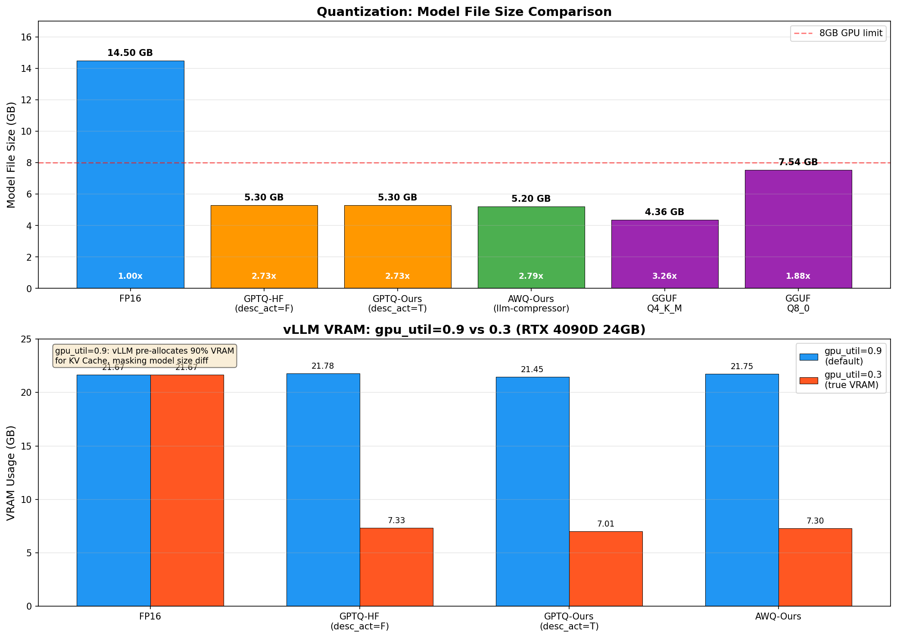
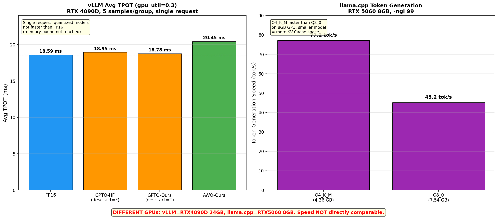

# 量化对比报告 (quantization-comparison.md)

## 1. 为什么需要量化

大模型推理的核心瓶颈是 **显存带宽**（memory bandwidth），而非算力（compute）。7B模型FP16权重约14.5GB，单张消费级显卡（如RTX 4090 24GB、RTX 5060 8GB）难以高效部署。量化通过降低权重精度（FP16→INT4/INT8），将模型压缩2-4倍，使7B模型可在8-24GB显存上运行。

量化的核心trade-off：**模型大小↓ 精度可能↓ 速度取决于使用场景**。

---

## 2. 数据总览

### 表1：vLLM结果（RTX 4090D 24GB，可直接比较）

| 模型 | desc_act | 文件(GB) | VRAM 0.9(GB) | VRAM 0.3(GB) | TPOT 0.9(ms) | TPOT 0.3(ms) | 吞吐 0.9 | 吞吐 0.3 | 压缩比 | BPW |
|------|----------|----------|-------------|-------------|--------------|--------------|---------|---------|--------|-----|
| FP16 | - | 14.5 | 21.67 | 21.67 | 17.67 | 18.59 | 56.95 | 53.98 | 1.00x | 16.0 |
| GPTQ-HF | False | 5.3 | 21.78 | **7.33** | 18.64 | 18.95 | 53.87 | 53.49 | 2.73x | ~4.5 |
| GPTQ-Ours | True | 5.3 | 21.45 | **7.01** | 18.64 | 18.78 | 53.88 | 53.71 | 2.73x | ~4.5 |
| AWQ-Ours | N/A | 5.2 | 21.75 | **7.30** | 18.58 | 20.45 | 53.94 | 49.33 | 2.79x | ~4.5 |

### 表2：llama.cpp结果（RTX 5060 8GB，仅内部比较）

| 模型 | 文件(GB) | BPW | 压缩比 | pp512(t/s) | tg128(t/s) | ms/tok | 备注 |
|------|---------|-----|--------|-----------|-----------|--------|------|
| Q4_K_M | 4.36 | 4.91 | 3.26x | 2935.88 | **77.20** | 12.9 | 混合精度(q6_K+q4_K) |
| Q8_0 | 7.54 | 8.50 | 1.88x | 1768.68 | 45.18 | 22.1 | 8GB显存受限 |

### 表3：全格式横向对比（不受GPU影响）

| 方案 | 文件(GB) | 压缩比 | BPW | 引擎 | 适用场景 | 精度 |
|------|---------|--------|-----|------|---------|------|
| FP16 | 14.5 | 1.00x | 16.0 | vLLM | 基线/精度优先(需14GB+) | 基准 |
| GPTQ-Int4 | 5.3 | 2.73x | ~4.5 | vLLM | 生产高并发(desc_act=F更快) | 无明显 |
| AWQ-Int4 | 5.2 | 2.79x | ~4.5 | vLLM | 生产高并发(llm-compressor) | 无明显 |
| GGUF-Q4_K_M | 4.36 | 3.26x | 4.91 | llama.cpp | 本地8GB显卡/CPU推理 | 轻微 |
| GGUF-Q8_0 | 7.54 | 1.88x | 8.50 | llama.cpp | 16GB+显卡/CPU推理 | 无明显 |

---

## 图表

---

## 3. 发现1：gpu_memory_utilization 陷阱

vLLM 默认 `--gpu-memory-utilization 0.9`，预分配90%显存给KV Cache。

**gpu_util=0.9 时**：所有模型VRAM ≈ 21.7GB，量化差异完全被掩盖。
**gpu_util=0.3 时**：FP16 占21.7GB，INT4模型仅7.0-7.3GB，**量化确实生效**。

---

## 4. 发现2：单请求下量化不提速

| 模型 | TPOT 0.3(ms) | 相对FP16 |
|------|-------------|----------|
| FP16 | 18.59 | 基线 |
| GPTQ-HF | 18.95 | +1.9% |
| GPTQ-Ours | 18.78 | +1.0% |
| AWQ-Ours | 20.45 | +10.0% |

**原因**：batch_size=1时，RTX 4090D对7B模型远未到memory-bound。Marlin kernel的反量化/scaling开销无法被带宽节省抵消。

**INT4的核心价值不在单请求速度，而在**：
1. 显存占用降低3倍，允许更大模型或更高并发
2. **高并发下memory bandwidth成为瓶颈时，吞吐提升显著**（待W5-W6并发压测验证）

---

## 5. 发现3：AWQ在低KV Cache下劣化

gpu_util=0.3时AWQ TPOT 20.45ms，比GPTQ的~18.9ms慢约10%。可能原因：KV Cache容量受限（仅30%显存分配），导致频繁swap/抢占。

gpu_util=0.9时AWQ TPOT 18.58ms，与GPTQ的18.64ms几乎一致。说明**在充足KV Cache下AWQ和GPTQ性能接近**。

---

## 6. 发现4：Q4_K_M混合精度策略

从`llama-quantize`量化日志中观察到：

| 权重类型 | Q4_K_M量化 | 说明 |
|---------|-----------|------|
| output.weight | **q6_K** | 输出层保留6bit |
| attn_v.weight（12/28层）| **q6_K** | 注意力V在关键层保留6bit |
| ffn_down.weight（12/28层）| **q6_K** | FFN降投影在关键层保留6bit |
| 其他权重 | q4_K | 其余用4bit |
| attn_norm/ffn_norm | f32 | LayerNorm不量化 |

---

## 7. 发现5：Q8_0在8GB卡上反而更慢

| 模型 | 文件大小 | tg128(tok/s) | 说明 |
|------|---------|-------------|------|
| Q4_K_M | 4.36 GB | **77.20** | 8GB显存充足 |
| Q8_0 | 7.54 GB | 45.18 | 8GB显存几乎占满 |

Q8_0模型7.54GiB几乎占满8GB显存，KV Cache空间极小，性能严重劣化。**结论：8GB显卡上Q4_K_M是唯一实用选择。**

---

## 8. GPTQ vs AWQ vs GGUF 核心区别

### GPTQ（分组量化）

- 原理：按校准数据集的Hessian信息，逐组量化权重，最小化重建误差
- 关键参数：`desc_act`（激活值排序）
  - desc_act=False：不排序，推理更快，精度略低
  - desc_act=True：按激活值重要性排序，精度略高，推理慢约7%
- 工具：AutoGPTQ + huggingface预量化模型
- 部署：vLLM，Marlin kernel加速

### AWQ（激活感知缩放）

- 原理：识别对激活值影响大的权重通道，对重要通道缩放后再量化，保护重要信息
- 不需要校准数据集排序（不需要desc_act）
- 工具：llm-compressor（vLLM官方，已取代AutoAWQ）
- 部署：vLLM，compressed-tensors格式，需`quantization=None`让vLLM自动检测

### GGUF K-Quant（混合精度）

- 原理：对重要权重用更高精度（q6_K），其余用低精度（q4_K），LayerNorm不量化
- 工具：llama.cpp的llama-quantize
- 部署：llama.cpp，单文件格式，支持CPU/GPU混合推理
- 优势：8GB显卡可用，CPU推理场景首选

### 选择建议

| 场景 | 推荐方案 | 原因 |
|------|---------|------|
| 生产高并发（24GB+） | GPTQ desc_act=False | 推理最快，vLLM Marlin kernel优化 |
| 生产高并发（精度优先） | AWQ (llm-compressor) | 激活感知保护精度 |
| 本地8GB显卡 | GGUF Q4_K_M | 唯一能在8GB跑7B的方案 |
| CPU推理/边缘部署 | GGUF Q4_K_M | llama.cpp CPU推理成熟 |
| 需要最高精度 | GGUF Q8_0 | 8bit精度损失最小（需16GB+显存） |

---

## 9. 数据局限性说明

1. **样本数不足**：vLLM数据仅5样本/组，P50/P90/P99不可靠，正式数据待后续完善
2. **无并发测试**：所有数据为单请求顺序测试，量化优势未在高并发下验证
3. **无TTFT数据**：未记录首token延迟
4. **不同GPU**：vLLM数据在RTX 4090D 24GB，llama.cpp数据在RTX 5060 8GB，速度不可直接比较
5. **AWQ量化参数受限**：llm-compressor校准仅64样本/128序列（默认256/512），精度可能低于全参数校准
6. **llama-bench指标与vLLM TPOT不完全对齐**：pp512是prefill阶段，tg128是decode阶段，需注意区分
