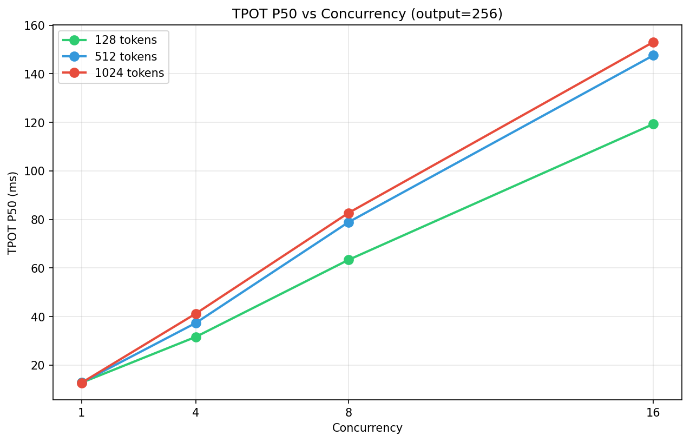
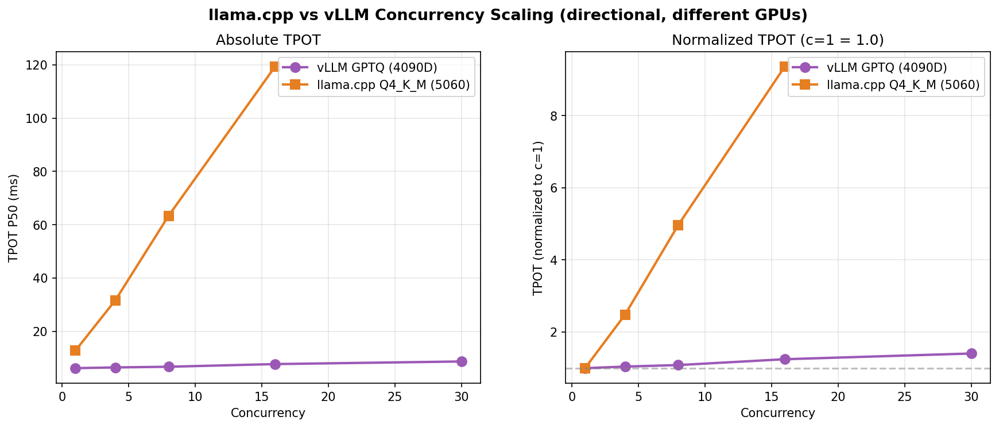
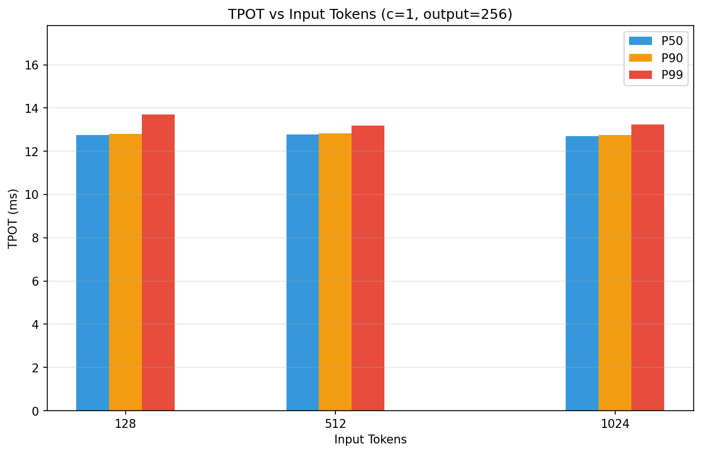
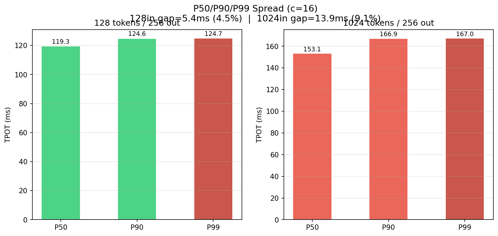

# W5: llama.cpp Q4_K_M 本地压测报告

> Qwen2.5-7B-Instruct Q4_K_M | RTX 5060 8GB | llama.cpp CUDA backend (n_gl=99)
> 矩阵：3 input × 2 output × 4 concurrency = 24 组 × 30 样本 = 720 请求
> 数据有效性：n=30 每组，P50/P90/P99 均可信

---

## 1. 实验设计

| 变量 | 取值 |
|------|------|
| Input tokens | 128 / 512 / 1024 |
| Output tokens | 64 / 256 |
| Concurrency | 1 / 4 / 8 / 16 |

**测量指标**：TTFT、TPOT（P50/P90/P99）、E2E latency、tokens/s

**脚本**：`src/benchmark/matrix_bench.py`（复用 `benchmark.py` 导函数，24 组自动编排）

---

## 2. vLLM 参数链速查

> 详见 `docs/W5/cb-params-chain.md`

- **`gpu_memory_utilization`**：控制 KV cache block pool 大小 → 决定并发容量上限，不影响单请求延迟
- **`max_num_seqs`**：调度器每轮 forward 最多参与计算的请求数 → 不改显存，只约束 batch size
- **实际并发 = min(max_num_seqs, 显存能装几个)**

本报告聚焦 llama.cpp，vLLM 参数链用于方向性对比。

---

## 3. 并发扩展分析

### 3.1 TPOT P50 vs Concurrency



| 输入 | c=1 | c=4 | c=8 | c=16 | 增幅 (c=1→16) |
|------|-----|-----|-----|------|--------------|
| 128 | 12.75 ms | 31.64 ms | 63.34 ms | 119.33 ms | +9.4× |
| 512 | 12.78 ms | 37.38 ms | 78.85 ms | 147.61 ms | +11.6× |
| 1024 | 12.70 ms | 41.24 ms | 82.67 ms | 153.11 ms | **+12.1×** |

**发现**：
- 短请求（128in）：c=1→16 TPOT 从 12.8→119ms，增长 9.4×
- 长请求（1024in）：c=1→16 TPOT 从 12.7→153ms，增长 12.1×
- 1024in 在 c=4 时已拉开差距（41.24 vs 31.64，+30%）

### 3.2 与 vLLM PagedAttention 对比（方向性）



> 不同 GPU 不可直接对比，仅供方向性参考

| 引擎 | GPU | c=1 TPOT | 最大并发 TPOT | 增幅 |
|------|-----|---------|------------|------|
| vLLM GPTQ-Int4 | RTX 4090D | 6.18 ms | 8.69 ms @c=30 | **+41%** |
| llama.cpp Q4_K_M | RTX 5060 | 12.75 ms | 119.33 ms @c=16 | **+9.4×** |

**核心差异**：vLLM 的 PagedAttention 将 KV cache 切成固定大小 block，所有请求共享 block pool，按需分配、用完归还。llama.cpp 为每个请求预分配一整块连续显存。在并发场景下，block 共享机制让 KV cache 的显存带宽利用率远超独占方案。**

---

## 4. 输入/输出长度影响

### 4.1 输入长度



c=1 时，128/512/1024 input 的 TPOT P50 差异 <2%（12.70–12.78ms），完全在噪声范围内。

**原因**：Decode 阶段的瓶颈是每步从显存读取完整模型权重（7B × Q4_K_M ≈ 3.5GB），而不是计算 attention。1024 token 比 128 token 多 8× 的 attention 计算量，但在读权重的开销面前微不足道。

### 4.2 输出长度

128in/64out c=1 TPOT=12.98ms，128in/256out c=1 TPOT=12.75ms，几乎相同。TPOT 是 per-token 时间的度量，与总输出长度无关。每生成一个 token 的计算量恒定：扫描历史 KV → 读权重 → FFN → softmax。

---

## 5. KV Cache 带宽瓶颈

### 5.1 单请求 KV Cache 估算

```
per_token_bytes = num_layers × num_kv_heads × head_dim × 2(K+V) × dtype
                = 28 × 4 × 128 × 2 × 2 = 57,344 bytes ≈ 56 KB/token
```

| 输入长度 | per-request KV Cache |
|---------|---------------------|
| 128 token | 128 × 56KB = **7 MB** |
| 512 token | 512 × 56KB = **29 MB** |
| 1024 token | 1024 × 56KB = **56 MB** |

### 5.2 并发容量

RTX 5060 8GB，llama.cpp Q4_K_M 模型约 3.5GB，CUDA graph/运行时约 1GB，可用 KV Cache ≈ 3.5GB。

| 输入长度 | 单请求 KV | 理论最大并发 |
|---------|----------|------------|
| 128 | 7 MB | ~500 个 |
| 1024 | 56 MB | ~62 个 |

c=16 远低于理论上限，但实测已出现明显延迟增长。瓶颈不是显存容量，而是**显存带宽**——16 条 sequence 同时读写各自 KV cache 争抢同一路 HBM 带宽。

### 5.3 P50/P90/P99 抖动对比（c=16）



| | P50 | P90 | P99 | P50→P99 差距 |
|---|-----|-----|-----|-------------|
| 128in/256out | 119.33 ms | 124.64 ms | 124.73 ms | +4.5% |
| 1024in/256out | 153.11 ms | 166.92 ms | 167.00 ms | **+9.1%** |

长请求不仅 P50 高出 28%（153 vs 119ms），P50→P99 差距也翻倍（9.1% vs 4.5%）。KV cache 抢占显存带宽导致延迟抖动加剧。

---

## 6. 异常数据说明

| 组 | P50 | P90 | P99 | 现象 |
|----|-----|-----|-----|------|
| 512in/64out c=1 | 12.72 | 12.86 | **30.01** | P99 跳 2.5× |
| 1024in/64out c=1 | 12.74 | 12.82 | **30.62** | P99 跳 2.5× |

各有 1 个请求延迟暴增至约 30ms（正常 P99 应 ≤15ms）。可能原因：CUDA graph 首次编译或 GPU 频率/P-state 切换。属于个别瞬时抖动，所有其他 718 个请求表现正常，不影响整体结论。

---

## 7. 结论

### 7.1 核心发现

| # | 发现 | 证据 |
|---|------|------|
| 1 | 输入/输出长度几乎不影响 TPOT（c=1） | 12.70–12.98ms，差异 <2% |
| 2 | 高并发下 1024in 延迟暴增 | c=1→16: +12.1× vs 128in +9.4× |
| 3 | P50→P99 抖动：长请求 2× 严重 | 1024in 9.1% vs 128in 4.5% |
| 4 | vLLM PagedAttention 并发优势巨大 | +41%@c=30 vs llama.cpp +9.4×@c=16 |

### 7.2 引擎选型建议

| 场景 | 推荐 | 原因 |
|------|------|------|
| 短请求 + 低并发（<512in, <8c） | llama.cpp | 低延迟、低显存、Q4_K_M 够用 |
| 长请求 + 高并发（>512in, >8c） | vLLM + GPTQ | PagedAttention block 共享、Continuous Batching |
| 受限显存（<8GB） | llama.cpp GGUF | 灵活量化级别、CPU fallback |
| 高吞吐在线服务 | vLLM | KV cache block pool、无 OOM 风险 |

---

## 附录

- 原始数据：`docs/W5/baseline-llama-matrix.csv`
- 参数链分析：`docs/W5/cb-params-chain.md`
- 百分位详细分析：`docs/W5/llama_data_compare_analysis.md`
- 图表脚本：`docs/W5/charts.py`
